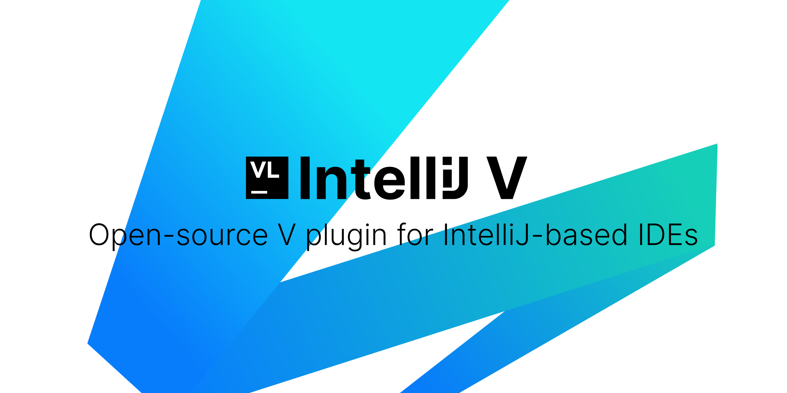

# V language plugin for JetBrains IDEs

## About

This plugin adds support of [V](https://vlang.io) language to JetBrains IDEs.

## Installation & Usage

If you want to jump straight in, use following instructions:

- Using IDE built-in plugin system:

  <kbd>Settings/Preferences</kbd> > <kbd>Plugins</kbd> > <kbd>Marketplace</kbd> > <kbd>Search for "Vlang"</kbd> >
  <kbd>Install Plugin</kbd>

- Manually:

  Download the [latest release](https://github.com/vlang/intellij-v/releases/latest) and install it manually using
  <kbd>Settings/Preferences</kbd> > <kbd>Plugins</kbd> > <kbd>⚙️</kbd> > <kbd>Install plugin from disk...</kbd>

## Compatible IDEs

The plugin is compatible with all IntelliJ-based IDEs starting from the version 2022.3, with the following differences
in the sets of the available features:

|                  | Open-source and Educational IDEs* | [CLion] (commercial) | [IntelliJ IDEA] Ultimate, [PyCharm] Professional, [GoLand] (commercial) | [WebStorm], [PhpStorm], other commercial IDEs |
|------------------|----------------------------------------------|----------------------|-------------------------------------------------------------------------|-----------------------------------------------|
| Language support | +                                            | +                    | +                                                                       | +                                             |
| Debugger         | -                                            | +                    | +**                                                                     | -                                             |

\* [IntelliJ IDEA] Community Edition, [PyCharm] Community Edition, [PyCharm Edu and IntelliJ IDEA Edu].

\** Requires the
[Native Debugging Support](https://plugins.jetbrains.com/plugin/12775-native-debugging-support) plugin.
LLDB only

## License

This project is under the **MIT License**. See the
[LICENSE](https://github.com/vlang/intellij-v/blob/master/LICENSE)
file for the full license text.
